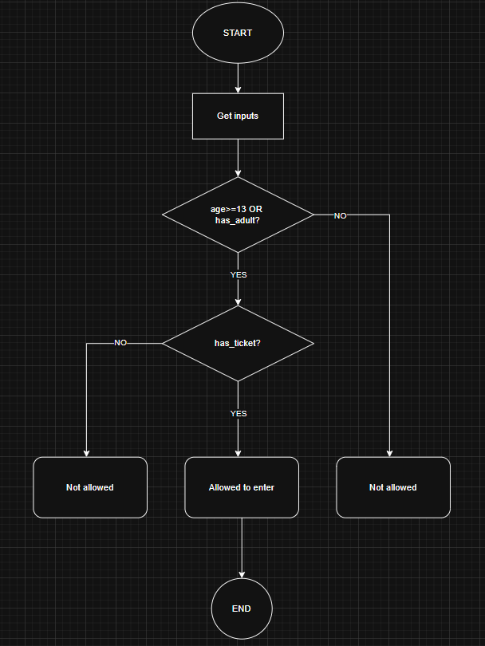

## Activity 1: Identify the components

### 1.1 What are the inputs?
age - person age (integer)
has_adult - accompanied by adult? (boolean)
has_ticket - has valid ticket? (boolean)

### 1.2 What is the process?
Check whether the person meets the age or adult requirement, AND has a valid ticket.

**Expression:** '(age >= 13 OR has_adult) AND has_ticket'

### 1.3 What is the output?
- `"You are allowed to enter."` - if the condition is True
- `"You are NOT allowed to enter."` - if the condition is False

---

## Activity 2: Design the Algorithm

### 2.1 Diagram


### 2.2 Truth table

| age >= 13 | has_adult | has_ticket | (age>=13 OR has_adult) | Allowed? |
|:---------:|:---------:|:----------:|:----------------------:|:--------:|
| T         | T         | T          | T                      | Yes      |
| T         | T         | F          | T                      | No       |
| T         | F         | T          | T                      | Yes      |
| T         | F         | F          | T                      | No       |
| F         | T         | T          | T                      | Yes      |
| F         | T         | F          | T                      | No       |
| F         | F         | T          | F                      | No       |
| F         | F         | F          | F                      | No       |

### 2.3 Algorithm (Step-by-step)

1. Start
2. Get input: `age`, `has_adult`, `has_ticket`
3. Check if `age >= 13` OR `has_adult`
4. Check if result AND `has_ticket`
5. If True → print "You are allowed to enter."
6. Else → print "You are NOT allowed to enter."
7. End

### 2.4 Pseudocode

```
BEGIN
  INPUT age
  INPUT has_adult
  INPUT has_ticket

  IF (age >= 13 OR has_adult) AND has_ticket THEN
    OUTPUT "You are allowed to enter."
  ELSE
    OUTPUT "You are NOT allowed to enter."
  END IF
END
```
---

## Activity 3: Evaluate Expression

### 3.1 Python Code

```python
# Movie Theater Admission Policy

age = int(input("Enter your age: "))
has_adult = input("Are you accompanied by an adult? (yes/no): ").lower() == "yes"
has_ticket = input("Do you have a valid ticket? (yes/no): ").lower() == "yes"

if (age >= 13 or has_adult) and has_ticket:
    print("You are allowed to enter.")
else:
    print("You are NOT allowed to enter.")
```

### Test Samples

| Test | Age | has_adult | has_ticket | Expected Output |
|------|-----|-----------|------------|-----------------|
| 1    | 15  | No        | Yes        | Allowed         |
| 2    | 10  | No        | Yes        | Not Allowed     |

---

